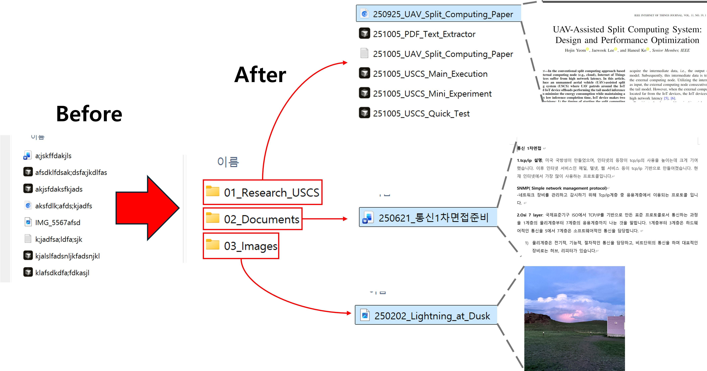

# 📂 File Manage MCP Server

Windows용 로컬 MCP 서버로, LLM이 파일 시스템을 정리할 수 있도록 도구를 제공합니다.

## ✨ 주요 기능

- **디렉토리 분석**: 파일/폴더 목록 조회, 날짜 정보 추출
- **파일 내용 확인**: 텍스트/코드 파일 스니펫 읽기 (cp949/euc-kr 인코딩 지원)
- **이미지 메타데이터**: EXIF 정보에서 촬영 날짜 추출
- **지능형 파일 분석**: 텍스트 분석 및 이미지 분석을 통한 파일명 제안 (LLM 연동)
- **파일 그룹핑**: 관련 파일 분석 및 자동 그룹핑 제안
- **파일 작업**: 이동, 이름 변경, 폴더 생성, 의미를 알 수 없는 파일명 정리
- **일괄 처리**: 날짜 접두사 일괄 추가, 다중 파일 그룹 폴더 이동
- **안전 기능**: Dry Run 모드, 샌드박스 제한, 시스템 폴더 보호

## 📋 파일 정리 규칙

### 2가지 절대 규칙
1. **5단계 규칙**: 디렉토리 깊이는 최대 5단계까지
2. **번호 체계**: 폴더는 `00~99` 접두사 사용 (예: `01_Project`), `99`는 Archive용

### 명명 규칙
- **폴더**: `NN_이름` 형식 (예: `01_Business`, `02_Project`)
- **파일**: `YYMMDD_파일명` 형식 (예: `251202_회의록.docx`)
- **버전**: `_v1.0` 형식 (Final, 최최최종 금지!)

## 🚀 설치 및 실행

### 요구 사항
- Windows 10/11
- Python 3.13+
- uv

## ⚙️ Claude Desktop 설정

### Claude Desktop 설정 (`claude_desktop_config.json`)

Windows: `%APPDATA%\Claude\claude_desktop_config.json`

```json
{
  "mcpServers": {
    "file-organization-agent": {
      "command": "uv",
      "args": [
        "--directory",
        "{your_path}/FileManageMCP",
        "run",
        "python",
        "server.py"
      ]
    }
  }
}
```

## 🛠️ 사용 가능한 도구

### 설정 도구
| 도구 | 설명 |
|------|------|
| `tool_set_dry_run` | Dry Run 모드 설정 (기본: 활성화) |
| `tool_get_status` | 현재 설정 상태 확인 |
| `tool_configure_workspace` | 작업 영역(샌드박스) 설정 |

### 분석 도구 (Read-Only)
| 도구 | 설명 |
|------|------|
| `tool_list_directory` | 디렉토리 내용 조회 (날짜 정보 포함) |
| `tool_read_file_snippet` | 파일 내용 미리보기 |
| `tool_get_image_metadata` | 이미지 EXIF 정보 추출 |
| `tool_analyze_directory_structure` | 디렉토리 구조 분석 및 문제점 파악 |

### 고급 분석 및 정리 도구
| 도구 | 설명 |
|------|------|
| `tool_find_files_needing_rename` | 의미를 알 수 없는 파일명을 가진 파일 찾기 (정리 대상 발굴) |
| `tool_suggest_filename_from_content` | 파일 내용(텍스트/문서) 분석용 요약 정보 반환 |
| `tool_get_image_for_analysis` | 이미지 파일 분석용 데이터 반환 (LLM Vision 연동) |
| `tool_analyze_file_relationships` | 파일 관계 분석 및 그룹핑 제안 |

### 액션 도구 (Dry Run 지원)
| 도구 | 설명 |
|------|------|
| `tool_move_file` | 파일 이동 |
| `tool_rename_file` | 파일/폴더 이름 변경 |
| `tool_rename_with_suggestion` | LLM 제안 이름으로 변경 (고급) |
| `tool_create_folder` | 새 폴더 생성 |
| `tool_group_files_into_folder` | 관련 파일들을 새 폴더로 일괄 이동 (고급) |
| `tool_batch_rename_with_date` | 날짜 접두사 일괄 추가 |

## 🔒 안전 기능

### Dry Run 모드 (기본 활성화)
- 모든 파일 수정 작업은 기본적으로 시뮬레이션만 수행
- 실제 변경 전 예상 결과 확인 가능
- `tool_set_dry_run(false)` 호출로 실제 모드 전환

### 샌드박스 제한
- `tool_configure_workspace`로 작업 영역 설정
- 설정된 영역 외부 접근 차단

### 시스템 폴더 보호
접근 차단되는 경로:
- `C:\Windows`
- `C:\Program Files`
- `C:\Program Files (x86)`
- `.git`, `node_modules` 등

## 📖 사용 예시

### 기본 워크플로우

```
User: D:\Downloads 폴더를 정리해줘

AI: 
1. 먼저 작업 영역을 설정합니다.
   → tool_configure_workspace("D:\\Downloads")

2. 현재 상태를 확인합니다.
   → tool_get_status()  # Dry Run 활성화 확인

3. 디렉토리 구조를 분석합니다.
   → tool_analyze_directory_structure("D:\\Downloads")

4. 의미를 알 수 없는 파일명 파일들을 찾아 정리합니다.
   → tool_find_files_needing_rename("D:\\Downloads")
   → tool_suggest_filename_from_content(...) 또는 tool_get_image_for_analysis(...)
   → tool_rename_with_suggestion(...)

5. 남은 파일들을 주제별로 그룹핑합니다.
   → tool_analyze_file_relationships("D:\\Downloads")
   → tool_group_files_into_folder("D:\\Downloads", "01_References", ["file1.txt", "file2.pdf"])

6. 결과 확인 후 실제 실행합니다.
   → tool_set_dry_run(false)
   → (위 작업 실제 수행)
```


## 📁 프로젝트 구조

```
FileManageMCP/
├── server.py          # MCP 서버 진입점 (FastMCP)
├── tools.py           # MCP 도구 함수 구현
├── utils.py           # 유틸리티 (경로 검증, 인코딩 처리)
├── requirements.txt   # Python 의존성
└── README.md          # 이 문서
```

## 📸 실행 예시


## 📜 License

This project is licensed under the MIT License - see the [LICENSE](LICENSE) file for details.

